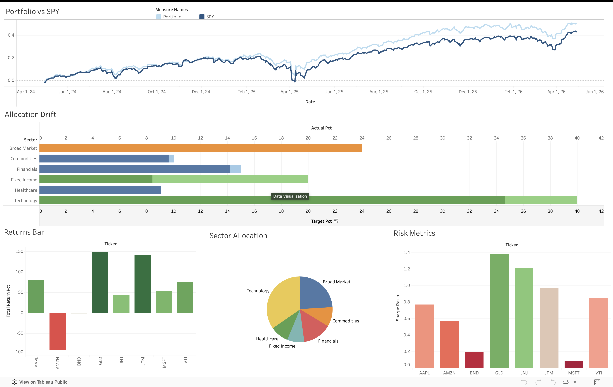

# 📊 Private Wealth Portfolio Health Monitor

A production-grade portfolio analysis tool that monitors holdings health, benchmarks performance against the S&P 500, surfaces risk signals, and exports structured data for Power BI dashboards.

**Built to simulate the kind of portfolio health visibility a Private Wealth advisor at a firm like Goldman Sachs would need** — combining quantitative rigour with actionable advisor-ready insights.

---

## Key Metrics Computed

| # | Metric | Description |
|---|--------|-------------|
| 1 | **Cumulative Returns** | Compounded returns vs SPY benchmark over 2 years |
| 2 | **Sharpe Ratio** | Risk-adjusted return per unit of volatility (annualised) |
| 3 | **Max Drawdown** | Largest peak-to-trough decline — measures downside risk |
| 4 | **Portfolio Beta** | Systematic risk relative to S&P 500 |
| 5 | **Allocation Drift** | Actual vs target sector weights with 5% drift flags |
| 6 | **Portfolio Health Score** | Composite score from normalised Sharpe, drawdown, and drift |

---

## Tools & Technologies

- **Python 3.10+** — core language
- **yfinance** — real-time and historical market data
- **Pandas & NumPy** — data manipulation and quantitative computation
- **Plotly** — interactive charts in Jupyter
- **Matplotlib & Seaborn** — static visualisations (fallback)
- **Power BI** — dashboard layer (CSV imports)

---

## Key Findings

> _Populated after running the analysis notebook_

- 🔹 *[Finding 1 — e.g. Portfolio returned X% vs SPY's Y% over 2 years]*
- 🔹 *[Finding 2 — e.g. Technology sector is overweight by Z%, recommend trimming]*
- 🔹 *[Finding 3 — e.g. Portfolio Sharpe of N indicates risk-adjusted performance]*

---

## Live Dashboard

[View the interactive Tableau Dashboard here](https://public.tableau.com/app/profile/shashank.kanojiya1043/viz/PWMWealthPortfolioMonitor/PrivateWealthPortfoliohealthMonitor)

---

## Screenshots



---

## How to Run

### 1. Install Dependencies
```bash
pip install -r requirements.txt
```

### 2. Run the Analysis Notebook
```bash
jupyter notebook analysis.ipynb
```
Run all cells sequentially. The notebook will:
- Fetch 2 years of market data via yfinance
- Compute all metrics
- Generate interactive Plotly charts
- Export 4 CSVs to the `data/` folder

### 3. Open Power BI Dashboard
1. Open Power BI Desktop
2. Import the 4 CSVs from `data/`
3. Follow the dashboard setup instructions in the notebook's final cell

---

## Project Structure

```
wealth-portfolio-monitor/
├── analysis.ipynb         ← main analysis notebook (6 sections)
├── portfolio_config.py    ← portfolio definition & targets
├── metrics.py             ← pure calculation functions (8 functions)
├── export.py              ← CSV export logic (4 exports)
├── data/
│   ├── daily_returns.csv
│   ├── portfolio_summary.csv
│   ├── allocation_drift.csv
│   └── cumulative_returns.csv
├── requirements.txt
└── README.md
```

---

## License

This project is for educational and portfolio demonstration purposes.
